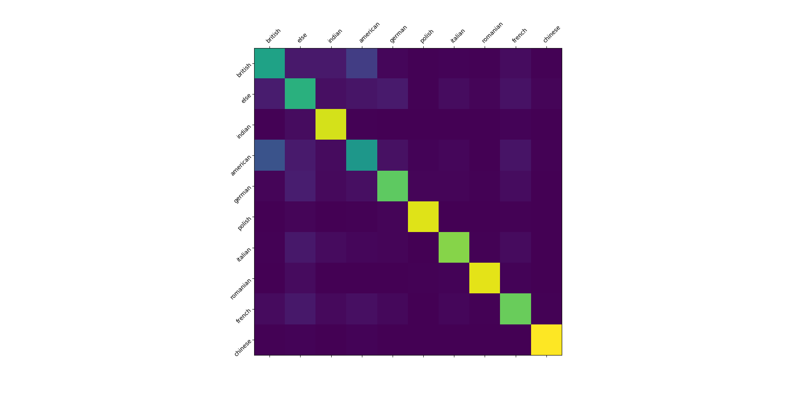
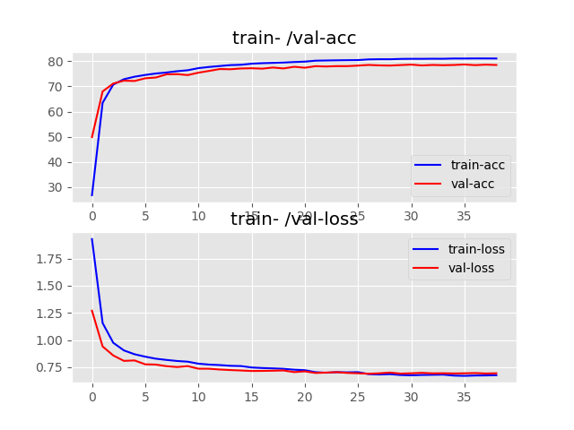

# name ethnicity classification

## this project uses a LSTM to assign ethnicities to names

## | the 10 ethnicities (this can change):
```json
{
    "british": 0, "else": 1, "indian": 2, "irish": 3, "american": 4,
    "german": 5, "polish": 6, "italian": 7, "romanian": 8, "french": 9,
    "chinese": 10
}
```

## | installation:
```bash
git clone https://github.com/hollowcodes/name-ethnicity-classification.git

cd name-ethnicity-classification/

pip install -r requirements.txt
```

## | usage:
 - ### predicting one name:
    ```
    python3 predict_ethnicitiy.py -n "Gonzalo Rodriguez" (upper-/ lower-case doesn't matter)

    >> name: Gonzalo Rodriguez - predicted ethnicity: spanish
    ```

 - ### predicting multiple names and save the output
    ```
    python3 predict_ethnicitiy.py -c "names.csv" "predictions.csv"
    ```

    Using the ```-c/--csv``` flag, you can predict an entire lists of names (names.csv, changeable) simutaneously and save them to another csv (predictions.csv, changeable).

    "names.csv" has to have one column named "names", ie.:
    ```csv
    1 names
    2 John Doe
    3 Max Mustermann
    ```

    If "predictions.csv" doesn't exist, it will be created.

## | results:

 - ### highest archived accuracy: 79.488%
 - ### confusion matrix:
<p align="center"> 

</p>
 - ### loss-/ accuracy-curve:
<p align="center"> 

</p>

 