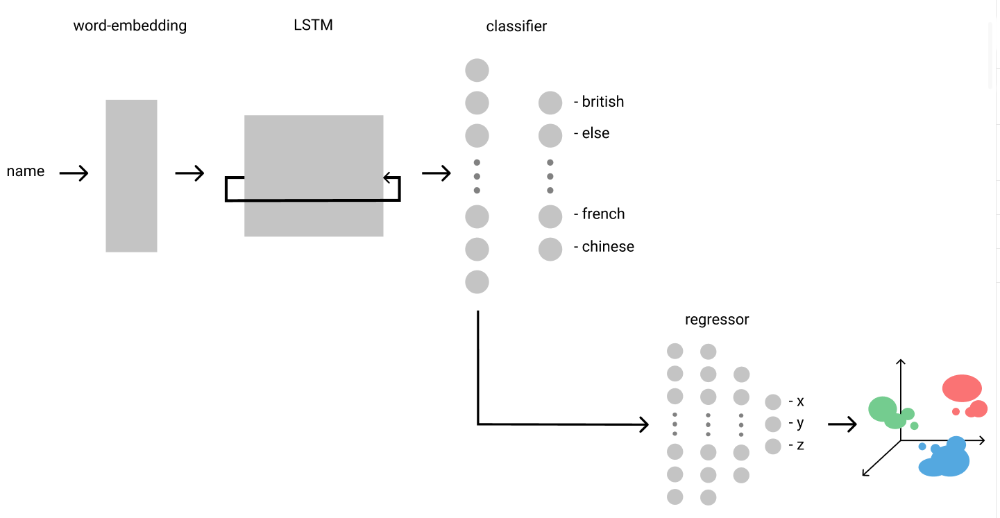

# name ethnicity classification

## this project uses a LSTM to assign ethnicities to names

## | currently distinguishes between these 10 countries:
```json
{
    "british": 0, "else": 1, "indian": 2, "american": 3, "german": 4, 
    "polish": 5, "pakistani": 6, "italian": 7, "romanian": 8, "french": 9, "chinese": 10
}
```

## | installation:
```bash
git clone https://github.com/hollowcodes/name-ethnicity-classification.git
cd name-ethnicity-classification/
pip install -r requirements.txt
```

## | usage:
 - ### predicting one name:
    ```
    python3 predict_ethnicitiy.py -n "Gonzalo Rodriguez" (upper-/ lower-case doesn't matter)

    >> name: Gonzalo Rodriguez - predicted ethnicity: spanish
    ```

 - ### predicting multiple names and save the output
    ```
    python3 predict_ethnicity.py -c "names.csv" "predictions.csv"
    ```

    Using the ```-c/--csv``` flag, you can predict an entire lists of names (in ```names.csv```, file name changeable) simutaneously and save them to another csv (```predictions.csv```, file name changeable).

    "names.csv" has to have one column named "names", ie.:
    ```csv
    1 names
    2 John Doe
    3 Max Mustermann
    ```

    After running the command, the "predictions.csv" will look like this:
    ```csv
    1 names,ethnicities
    2 John Doe,american
    3 Max Mustermann,german
    ```

    If the output file doesn't exist, it will be created.


## | results:

 - ### highest archived accuracy: 79.2%
 - ### confusion matrix:
<p align="center"> 

</p>

 - ### loss-/ accuracy-curve:
<p align="center"> 

</p>


## | contrastive name clustering:
Additional to the classification, names are [clustered in 3d space](src/contrastive-name-clustering/).

### - method:
To archieve that, the last classification layer is being ignored and the output-embeddings of the prior layer (dim: 32, 1) get saved.
Those will be fed into another simpler ["coordinate-model"](src/contrastive-name-clustering/coord_model.py) which outputs three values: x, y, z (3d coordinates).

<p align="center"> 

</p>

### - loss:
The loss is a custom [contrastive-cosine-similarity loss](src/contrastive-name-clustering/contrastive_loss.py):

After a batch ```B``` passes through the coordinate-model, a target batch ```B'``` is created, which is just ```B``` but flipped by 180 degrees.

                            x1 = B ; x2 = flip(B, 2)

Additional to that, another vector ```y``` is created: For each index ```i```, this vector holds either ```0``` or ```1```.
```y_i``` is ```0```, when the original batch ```B``` and ```B'``` have a sample of the same target/nationality at index ```i```, and ```1``` if they are from different nationalities. ```B_i``` and ```B'_i``` are considered "partner-coordinates".

The loss then caluclates the cosine-similarity (cos-angle between two matrices). When two coordinates aren't from the same nationality, we subtract it from ```1```, to get the inverted value. Otherwise it would represent the difference instead of the similarity.
                                    
                                    y = {0; 1}
                        similarity = |-y + cossim(x1, x2)|

Additional to that, if ```B_i``` and ```B'_i``` are two different nationalities, the loss is multiplied by a value ```beta ]0;1[```, which reduces the weight of that loss. The reason: When flipping the batch ```B```, the chance that the partner coordinates are from the same nationality is ```10%```, since there are 10 different nationalities. So there should be more weight for same-nationality coordinates, because there are far less of them.

                    similarity = (y * beta) * |-y + cossim(x1, x2)|


### - result:

<p align="center"> 

</p>


