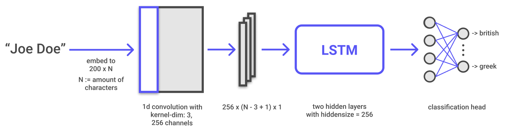

# name ethnicity classification experiments

## about:
 - ### this repository contains the experiments for finding the best model for our name-ethnicity-classification task.

 - ### the different model architectures are stored in the folder [src/experiments](src/experiments/).

 - ### the "winning" model is stored in the folder [src/final_model/](src/final_model/).

---

## the "winning" model:
 - ### the final model is a simple convolutional-lstm neural network which can be found [here](src/final_model/model.py).
 - ### we trained this model on multple sets of nationalities and made it usable in with console-interface program in our [name-ethnicity-classifier](https://github.com/name-ethnicity-classifier/name-ethnicity-classifier) repository.
 - ### architecture:  

<!---
---

## other findings:

- ### clusters of LSTM embeddings (left: random transformation, right: PCA):

 

- ### conclusions:
  - british and american names are very close to each other
    
      -> probable reason: they have the same language
  - british and american names are in the middle of the cluster formation
    
      -> probable reason: names of those two countries appear often in other countries

  - in every cluster, there are a few names which, according to the dataset, don't belong there (false positives/negatives)
    
      -> probable reason: such names belong to people whose ancestors or who themselfes have emigrated or taken another citizenship

  - the three findings above are probably largely responsible for the reduction of accuracy of the model

  - nationalities with a very specific name-type (like chinese) have more dense clusters and/or are more distant from the middle

-->