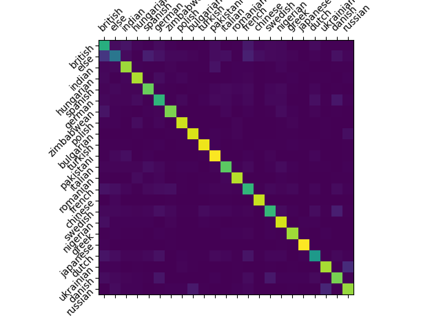
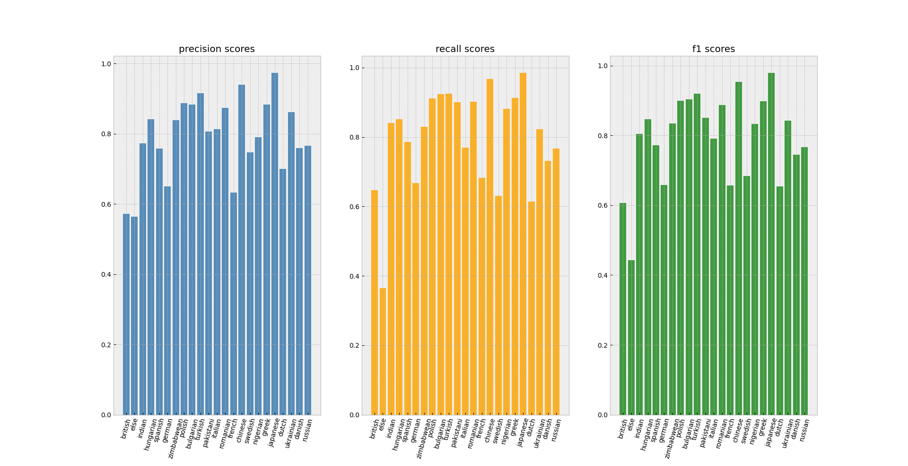
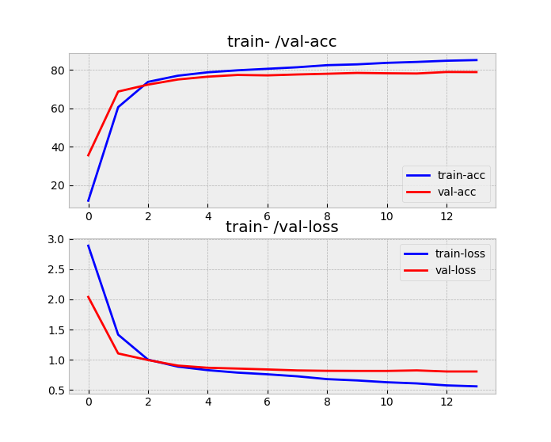
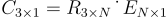

# name ethnicity classification

## this project assigns ethnicities to names


## | installation:
- prerequisites: python-3.7, conda environment recommended
- steps:
    ```bash
    git clone https://github.com/hollowcodes/name-ethnicity-classification.git
    cd name-ethnicity-classification/
    pip install -r requirements.txt
    ```

## | usage:

 - ### training (since the dataset is private training is only possible for the authors):
    
    1. configure the wanted nationalities using  ```src/preprocessing.py``` or add the dataset to ```src/datasets/preprocessed_datasets/``` (this folder must then contain one file called ```matrix_name_list.pickle``` and ```nationality_classes.json```)

    2. navigate to ```src/final_model```
    3. edit ```train_model.py``` by specifing the dataset folder name, a descriptive name for the experiment/run
    4. run ```train_model.py```

 - ### predicting multiple names and save the output
    ```
    python3 predict_ethnicity.py -c "names.csv" "predictions.csv"
    ```

    Using the ```-c/--csv``` flag, you can predict an entire lists of names (in ```names.csv```, file name changeable) simutaneously and save them to another csv (```predictions.csv```, file name changeable).

    "names.csv" has to have one column named "names", ie.:
    ```csv
    1 names
    2 John Doe
    3 Max Mustermann
    ```

    After running the command, the "predictions.csv" will look like this:
    ```csv
    1 names,ethnicities
    2 John Doe,american
    3 Max Mustermann,german
    ```

    If the output file doesn't exist, it will be created.

 - ### predicting one name:
    ```
    python3 predict_ethnicitiy.py -n "Gonzalo Rodriguez" (upper-/ lower-case doesn't matter)

    >> name: Gonzalo Rodriguez - predicted ethnicity: spanish
    ```

## | results:

 - ### highest archived accuracy: 79.6%
 - ### confusion matrix:



<details>
<summary><b>precision-/ recall-/ and f1-scores</b></summary>



</details>

<details>
<summary><b>loss-/ accuracy-curve</b></summary>



</details>
   
    
## | cluster for visual interpretation
The data from which the clusters are created are not directly the embeddings of the names, but instead the output-embeddings ```E```, which get produced by the LSTM layer of the classifier (the last two layers are being ignored). The goal is to get an insight into the feature-extraction process of the LSTM.
(The colors represent the ground truth.)

### using random-transformation:
To create clusters using this method, the output-embeddings ```E``` are each (matrix-) multiplied with the same random matrix ```R``` and (optionally) passed into the sigmoid function.
Since the result ```C``` of this multiplication must be ```3 x 1```, so it can be plotted in 3d space, ```R``` must have the dimensions ```3 x N``` where ```N``` is the length of ```E```.


<p align="center"> 

</p>

#### result:
<p align="center"> 

</p>

### using principal-component-analysis:
With PCA the high-dimensional outputs embeddings get projected into 3d space.

#### result:
<p align="center"> 

</p>

### conclusions:
- british and american names are very close to each other
  
    -> probable reason: they have the same language
- british and american names are in the middle of the cluster formation
  
    -> probable reason: names of those two countries appear often in other countries

- in every cluster, there are a few names which, according to the dataset, don't belong there (false positives/negatives)
  
    -> probable reason: such names belong to people whose ancestors or who themselfes have emigrated or taken another citizenship

- the three findings above are probably largely responsible for the reduction of accuracy of the model

- nationalities with a very specific name-type (like chinese) have more dense clusters and/or are more distant from the middle


