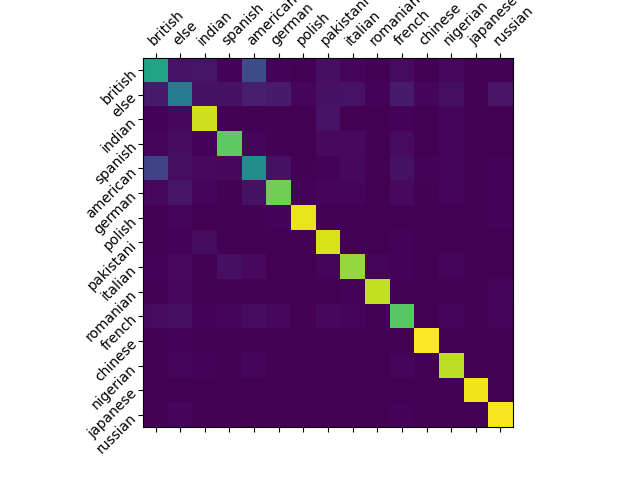

# this model classifies 14 nationalities and the "else" category

## | inputs:
 - must contain first and last name and can contain multiple middle names
 - only the 26 letters of the standard latin alphabet and spaces allowed

#

## | nationalities the model can classify:
```json
{
    "british": 0, "else": 1, "indian": 2,
    "spanish": 3, "american": 4, "german": 5,
    "polish": 6, "pakistani": 7, "italian": 8,
    "romanian": 9, "french": 10, "chinese": 11,
    "nigerian": 12, "japanese": 13,"russian": 14
}
```

#

## | performance and result metrics:
 - accuracy: 80.95%
 - confusion matrix: <br/> 
 - recall, precision and f1-scores: <br/> 

#

## | the model (stored in "src/final_model/"):
 - one 1d convolutional layer with input_features=200 and output_features=64 
 - followed by an LSTM with two internal layers
 - one final classification layer with log-softmax


